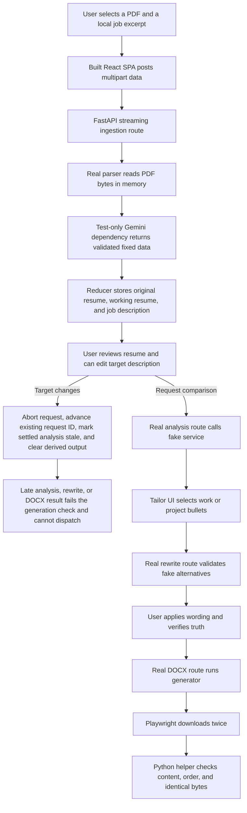

# Platform Hardening And Purposeful Motion Plan

## 1. Feature overview

### Problem

Beat ATS has a strong truth and privacy model, but four platform gaps reduce confidence:

- The browser tests replace every API response. They do not prove that the built React app, FastAPI, the document parser, a deterministic Gemini boundary, and the DOCX generator work together.
- The user cannot change the target job description after resume upload. A changed target can leave analysis, rewrite suggestions, truth checks, and a generated file out of date.
- The product and functional documents say that tailoring is limited to work-experience bullets, although the backend, UI, and tests also support project bullets.
- The repository has a removable JSON ingestion route, one high `nanoid` production advisory, no fail-closed private-production rule, and motion that does not yet explain the four-stage workflow.

### Users

The first release serves one job seeker in a private deployment. The user must keep control of candidate facts, AI requests, accepted wording, and the final file.

### Source documents and evidence

- Product contract: `PRODUCT.md`
- Design contract: `DESIGN.md`
- Current behavior: `FUNCTIONAL_OVERVIEW.md`
- Setup and release commands: `README.md` and `DEPLOYMENT.md`
- Backend seams: `analyzer.py`, `schemas.py`, `parser.py`, and `generator.py`
- Frontend state and data path: `frontend/src/SessionContext.tsx`, `frontend/src/state.ts`, `frontend/src/App.tsx`, and `frontend/src/api.ts`
- Current browser coverage: `frontend/e2e/`
- Deployment controls: `Dockerfile`, `compose.yaml`, `vercel.json`, and `.github/workflows/ci.yml`
- Current job sources, checked on 2026-08-25:
  - Canonical, Senior/Staff/Principal Engineer: <https://canonical.com/careers/5142887/senior-staff-principal-engineer-remote>
  - Relay, Senior Frontend Developer (React, TypeScript): <https://jobs.lever.co/relay/08053706-31b5-4fe1-9546-ad04b9cb0140>
- Current Vercel protection guidance, checked on 2026-08-25: <https://vercel.com/docs/deployment-protection>
- Plan presentation guidance, checked on 2026-08-25: <https://vercel.com/design.md>

### Success outcome

One repeatable local test drives the built SPA through a real FastAPI process and a fake Gemini service. The same test validates the generated DOCX and a repeated download. The user can change the target job description without another upload, and all dependent state becomes visibly out of date or is cleared before reuse. The repository has one ingestion route, no known high or critical production advisory, a clear private-deployment boundary, and restrained motion that explains stage and action state.

## 2. User stories

- As a job seeker, I can upload my resume once and change the target role later so that I can correct or replace the job description without repeating extraction.
- As a job seeker, I can see when a target-role change makes analysis, suggestions, truth checks, or a generated file out of date so that I do not trust stale output.
- As a job seeker, I can tailor supported work-experience and project bullets, and the product documents state this behavior correctly.
- As a job seeker, I get brief visual continuity when I move through Upload, Review, Tailor, and Export, and I get clear confirmation when analysis arrives, wording is applied, or a file is ready.
- As a keyboard or reduced-motion user, I keep the same focus order, status messages, and complete state feedback without spatial movement.
- As a maintainer, I can run one real integration scenario without a Gemini key or a network call and inspect the DOCX against the same structured source used by the UI.
- As a deployer, I can tell whether a deployment is private before I send candidate data to it.

## 3. Scope

### In scope

- A test-only FastAPI application that overrides the Gemini dependency with deterministic behavior.
- One built-SPA Playwright integration scenario with no API interception.
- Runtime generation of a non-private synthetic PDF for CI and use of `Holyworth_Akhigbe_Frontend_resume.pdf` through an environment variable when the local file exists.
- Two dated, local job-description source records with short stable excerpts. The integration test uses a local excerpt and never fetches a live job page.
- DOCX text and section-order inspection, plus byte-for-byte repeated-download verification.
- Editable target job description in Review and centralized derived-state invalidation.
- Reuse of the existing monotonic request ID to reject late analysis, rewrite, and DOCX completion or cleanup after source state changes.
- Removal of the unused non-streaming ingestion route and client function after its tests move to the streaming route.
- A supported lockfile or dependency update that resolves `GHSA-2v37-7h3g-55p8`.
- One GSAP stage timeline and small analysis, apply, and export acknowledgements.
- Updates to product, functional, design, README, deployment, API, unit, integration, visual, and accessibility evidence.

### Out of scope

- Accounts, application authentication, saved projects, history, a database, browser persistence, public sharing, CORS, or object storage.
- Live job-site access during tests.
- A second browser framework or a second production ingestion route.
- OCR, PDF export, new resume templates, ATS vendor scoring, job-board integration, or an application tracker.
- Motion on scroll, decorative motion, parallax, celebration effects, or animated hover and focus behavior in GSAP.
- A redesign of the Beat ATS information architecture or component library.

### Dependencies

- Python 3.11 or newer and the existing Python dependencies, including `python-docx` and the development-only `reportlab` package.
- Node 22 or newer and Playwright Chromium.
- The existing FastAPI dependency-override seam in `get_gemini_service`.
- `gsap` as the only new production package.
- A hosting-provider access gate for private production. Vercel Standard Protection is not sufficient for the production domain.

### Assumptions

- The supplied resume remains outside Git. Local verification passes its path with `BEAT_ATS_INTEGRATION_RESUME`.
- CI generates a small synthetic, non-private PDF at runtime with the existing `reportlab` development dependency when the private file is not present. No PDF fixture or ignore exception is added.
- The fake Gemini service returns a fixed structured resume and fixed analysis. It creates rewrite alternatives from the selected source bullets and never creates a Google client.
- The documented `POST /api/v1/resumes/ingest` route has no supported external consumer. This private single-user product accepts its removal as a breaking API change. The route, client helper, API types, tests, README text, and delivery release note change as one compatibility unit.
- Provider access controls are an operational prerequisite. They cannot be enforced in `vercel.json` alone.

## 4. Recommended approach and simplicity decisions

### Minimum viable design

Use one `integration_scenario.json` packet, one runtime PDF generator, one test-only FastAPI module, one minimal static-target preparation script, and one Playwright config for the real stack. Do not change the production application factory or lifespan. The test module applies `app.dependency_overrides[get_gemini_service]`. Playwright starts its child process from the repository root with `GEMINI_API_KEY` set to an empty value and `reuseExistingServer: false`. Before the standard Uvicorn command starts, the preparation script removes only the verified ignored `public/` test target, copies the new `frontend/dist` build into it, and writes a build marker. Playwright owns occupied-port failure, startup, and shutdown.

Keep React state as the source of truth. Add one `jobDescriptionUpdated` reducer action and reuse one derived-state invalidation function. A target change keeps the verified resume and accepted wording, retains settled old analysis only as stale evidence, and clears selections, generated alternatives, acknowledgement checkboxes, and the generated DOCX.

Reuse the existing monotonic request ID from `nextRequestId` and `requestRef` as the only asynchronous completion token. Do not add a second generation ref. Refactor the request runner so network tasks return data without dispatching inside their promise chain. Advance the ID when a request starts and when source state changes, the user cancels, or the session clears. Each request captures its ID. Analysis, rewrite, and DOCX success handlers dispatch only when the captured ID is still current and the request signal is not aborted. Guard `finally` cleanup with the same ID so an old request cannot clear the controller or busy state of a newer request. This guard is required even when abort does not stop a delayed response.

Use the existing streaming route as the only ingestion path. Remove the unused JSON route and `ingestResume()` client helper. Move route tests to JSON Lines result and error assertions. This is an accepted breaking API change because the product has no supported external API consumer. Apply and roll back the route, client helper, generated types, tests, README contract, and delivery release note together.

Install GSAP directly. Use one small page-owned motion module or hook, not a motion framework. The focal stage timeline coordinates the current step marker and stage surface. Component-level acknowledgements run only when their real React state changes. CSS continues to own hover, focus, and accordion behavior.

Document a fail-closed deployment rule. For Vercel, private production requires the **All Deployments** scope with an allowed access method and a plan that supports private production. Standard Protection protects previews and generated deployment URLs, but it leaves the production domain public. If the production gate is unavailable, the approved fallback is localhost or another private provider boundary, not a public deployment.

### Options rejected

| Rejected option | Why it is not used |
| --- | --- |
| Add application login | It changes the product boundary and creates account, session, recovery, and security work that the brief excludes. |
| Keep both ingestion routes | The non-streaming route has no frontend consumer. Keeping it adds duplicate contract and test work without a compatibility need. |
| Fetch job pages during tests | It makes the suite slow and flaky and sends test behavior to third parties. |
| Add a Node DOCX or ZIP package | Python already has `python-docx`; a small test helper is enough. |
| Add `@gsap/react` or a general motion layer | Direct GSAP context cleanup is sufficient for four bounded effects. |
| Animate all page content or scroll | It does not explain state and conflicts with the restrained design and reduced-motion contract. |
| Refactor FastAPI into an application factory | The existing dependency override is enough for this test. The refactor would add unrelated risk. |

## 5. Data and state path



### State, cache, and invalidation rules

- No browser cache or persistence is added. All source and derived data stays in reducer memory.
- `jobDescriptionUpdated` trims only when a request is sent. The editor preserves the user's current input while they type.
- A job-description change keeps `resume`, `originalResume`, `warnings`, and valid `appliedChanges`.
- A job-description change sets `analysisStale` when analysis exists and clears `selectedBulletIds`, `activeBulletId`, `selectionLocked`, `rewritesByBulletId`, `openedSuggestionIds`, `truthConfirmations`, `docxBlob`, and export progress or completion state.
- A new request, resume or job-description change, manual cancellation, or session clear advances the existing request ID. Source changes, cancellation, and clear also abort the active request. Late analysis, rewrite, and DOCX completions are ignored before they can update state, advance the step, start a download, or repopulate a cleared session. An old `finally` block cannot clear the controller or busy state for the current request.
- A new successful analysis replaces the stale analysis and sets `analysisStale` to false.
- No request result cache is added. The existing abort behavior continues to allow one active application request.

### UI states

| State | Required behavior |
| --- | --- |
| Review with unchanged target | Show the current target text and allow editing. The comparison action uses that current text. |
| Review with changed target and prior analysis | Show a text status that the prior comparison is out of date. Clear suggestions, truth checks, and the generated file before they can be reused. |
| Target shorter than 50 characters | Keep the text, show an inline error, and do not send an analysis request. |
| Analysis loading | Keep the Review stage and current target visible. Use the existing busy text and cancel or error path. |
| Target edited while analysis is loading | Abort and invalidate the old request. A delayed old response cannot advance to Tailor or become current. The user can request a new comparison for the new target. |
| Analysis available | Announce the result in the existing status model and run a short visual acknowledgement. |
| Analysis failed | Keep resume and target edits. Show the existing retry action and request ID when available. |
| No selectable bullets | Keep the existing empty Tailor state and allow export without tailoring. |
| Applied wording | Keep the explicit Apply action, persistent text label, restore action, and a short Emerald acknowledgement. |
| DOCX ready | Start the first download, retain the Blob for Download again, show a persistent ready status, and run a short acknowledgement. |
| Reduced motion | Do not move or scale content. Set final visual state immediately and preserve focus and live-region messages. |

## 6. Implementation phases

### Phase 0: Run Ponytail Full before all implementation edits

**Goal:** Record the smallest implementation boundary before any fixture, dependency, product code, test, CI, or documentation file changes.

**Work items**

1. Run Ponytail Full against the accepted work brief and current repository before implementation starts.
2. Record the required work, deletions, and simplifications in implementation notes. Do not edit product or documentation files during this gate.
3. Confirm that the implementation still uses one integration harness, the existing request ID as its only completion token, one ingestion path, one GSAP dependency, and provider controls instead of application authentication.
4. Stop and return to planning only if Ponytail finds a simpler path that changes an accepted requirement or risk control.

**Impacted files and systems**

- Read-only repository inspection
- Implementation notes outside product source

**Exit criteria**

- Ponytail Full completes before all implementation edits.
- The implementation worker records the result and preserves every accepted requirement.

### Phase 1: Freeze safe fixtures and dependency evidence

**Goal:** Create stable, non-private integration inputs and remove the known production advisory with the smallest package update.

**Work items**

1. Add `tests/fixtures/integration_scenario.json`. Put both dated job-source records, their direct URLs and stable excerpts, the selected Relay React and TypeScript excerpt, one non-private extracted resume that populates every generator-supported section, and one deterministic analysis result in this file. Do not copy a full posting.
2. Add `tests/create_integration_pdf.py`. Use the existing `reportlab` development dependency to generate a small non-private PDF inside the Playwright test output directory at runtime. Keep the private supplied PDF outside the repository. Do not commit a PDF and do not add a `.gitignore` exception.
3. Add `gsap` to `frontend/package.json` and refresh `frontend/package-lock.json` with npm. Update the lock within the existing Vite 7 range so PostCSS resolves `nanoid` 3.3.18 or newer. Do not add an override unless a normal lock update cannot resolve it.
4. Record before-and-after `npm audit --omit=dev` output in delivery notes, not in the repository.

**Impacted files and systems**

- `tests/fixtures/integration_scenario.json` (new)
- `tests/create_integration_pdf.py` (new)
- `frontend/package.json`
- `frontend/package-lock.json`

**Exit criteria**

- Both job sources have stable local excerpts and source metadata.
- The synthetic PDF is created at runtime, and no PDF fixture, private resume, or full job posting is staged.
- `npm audit --omit=dev` reports zero high and critical production advisories.
- `gsap` is the only new production dependency.

### Phase 2: Add the real-stack integration test and consolidate ingestion

**Goal:** Prove the built SPA, FastAPI, parser, fake Gemini boundary, schemas, rewrite validator, generator, and browser download as one system.

**Work items**

1. Add `tests/integration_app.py`. Load `integration_scenario.json`, implement the three fake Gemini methods, and override `get_gemini_service`. Do not replace the application lifespan. The integration child receives an empty `GEMINI_API_KEY`, so startup cannot construct a Google client.
2. Add `tests/inspect_docx.py`. Read a downloaded file with `python-docx` and return ordered paragraph text, section headings, table count, header/footer text, and other facts needed by Playwright. Do not change the production generator.
3. Add `tests/prepare_integration_static.py`. Resolve and validate only `<repo>/public` and `<repo>/frontend/dist`, remove only the ignored `public/` test target, copy the just-built distribution into it, and write a unique build marker. Do not manage a port, launch a server, replace a lifespan, or handle shutdown in this helper.
4. Add `frontend/playwright.integration.config.ts`. Build `frontend/dist`, run the preparation helper, and then use the standard Uvicorn command as the Playwright `webServer` child. Set its working directory to the repository root, set its child environment `GEMINI_API_KEY` to an empty value, set `testMatch` to the real-stack spec, and set `reuseExistingServer: false`. Let Playwright reject an occupied port and own process startup and shutdown.
5. Add `frontend/e2e/integration.spec.ts`. Do not call `page.route()` for application API paths. Assert the unique build marker before the workflow. Use `BEAT_ATS_INTEGRATION_RESUME` when set and readable; otherwise call `tests/create_integration_pdf.py` and place its output under `testInfo.outputPath()`.
6. Complete upload, review, comparison, selection of one work bullet and one project bullet, and rewrite generation for both. Open both suggestion results, apply at least one alternative, and assert that the final UI model contains the accepted text.
7. Complete final truth checks, the first download, and Download again. Inspect the first DOCX and assert that every populated section matches the reviewed model and appears in generator order: contact, Professional Summary, Work Experience, Skills, Education, Certifications, Projects, then additional sections. Assert that the accepted replacement text is present and its replaced source text is absent. Assert zero tables and empty headers and footers.
8. Compare the two downloaded byte buffers. State in the test name and documentation that this proves repeat download from the retained browser Blob. It does not prove a second generator run. Keep generator determinism checks in focused Python tests.
9. Add `e2e:integration` to `frontend/package.json` and add the command to CI after the normal Playwright suite.
10. Apply the accepted endpoint compatibility disposition. Remove `POST /api/v1/resumes/ingest` from `analyzer.py` and remove `ingestResume()` from `frontend/src/api.ts`. This product has no supported external API consumer, so no deprecated alias is kept.
11. Move non-streaming ingestion tests in `tests/test_analyzer.py` to `/api/v1/resumes/ingest/stream`. Keep pre-stream HTTP assertions for upload-size failures and parse JSON Lines for progress, result, and terminal domain errors.
12. Regenerate `frontend/src/api-types.ts`, update the API list in `README.md`, and record the accepted breaking removal in the delivery or pull-request release notes. Keep the route code, helper, types, tests, README contract, and release note in one change and rollback unit.

**Impacted files and systems**

- `tests/integration_app.py` (new)
- `tests/inspect_docx.py` (new)
- `tests/prepare_integration_static.py` (new)
- `tests/create_integration_pdf.py` (new, shared from Phase 1)
- `frontend/playwright.integration.config.ts` (new)
- `frontend/e2e/integration.spec.ts` (new)
- `frontend/package.json`
- `.github/workflows/ci.yml`
- `analyzer.py`
- `tests/test_analyzer.py`
- `frontend/src/api.ts`
- `frontend/src/api-types.ts`
- `README.md`

**Backend data and migration notes**

- Query optimization: not applicable. The product has no database and the route changes do not add data access.
- N+1 prevention: not applicable. The test and API operate on one in-memory resume document.
- Migration: no schema or storage migration exists. API clients move to the existing stream route before the JSON route is removed in the same change.

**Detailed backend test cases**

- Streaming ingestion emits parsing, structuring, validating, and result records in order.
- Oversized upload fails before the stream starts and before the fake service runs.
- Empty DOCX, corrupt input, encrypted input, and vision-permission errors keep their current status or terminal error contract.
- A client disconnect cancels provider work.
- The fake integration service accepts text extraction and cannot call Gemini.
- Rewrite validation accepts both work and project bullet IDs and rejects changed source text, unknown IDs, duplicates, and new numeric facts.
- DOCX generation includes all populated sections in order and has no ATS-hostile tables, headers, or footers.

**Exit criteria**

- The real-stack test passes with the synthetic PDF and with the supplied local PDF path.
- The integration spec has no application API interception.
- Playwright starts Uvicorn from the repository root with an empty `GEMINI_API_KEY`, serves only the just-built SPA, proves the build marker, rejects an occupied port, and never reuses a process.
- One accepted rewrite crosses the UI model into the DOCX. The new text is present and the replaced text is absent.
- The two downloads are equal as proof of retained-Blob repeat download, and the first file passes precise content, order, and structure checks.
- OpenAPI exposes only the required stream ingestion path.

### Phase 3: Make the target role editable and invalidate dependent state

**Goal:** Let the user replace or correct the target job description after upload without re-uploading the resume.

**Work items**

1. Add a `jobDescriptionUpdated` action in `frontend/src/state.ts`. Generalize the existing invalidation logic so resume and target changes share the same reset contract while resume edits still filter invalid applied-change records.
2. Refactor the request runner in `SessionContext.tsx` so asynchronous tasks return data and only a guarded success handler dispatches it. Reuse `nextRequestId` and `requestRef` as the sole monotonic completion token. Do not add a generation ref. Advance the ID on request start, resume or target change, manual cancellation, and session clear. Each derived request captures the current ID. Source changes, cancellation, and clear abort the active request.
3. Apply the request-ID and abort guard to analysis, rewrite, and DOCX success. Apply the same request-ID guard to `finally` cleanup. A late response must not update state, advance the stage, start a download, reset stale status, clear the current controller, or set a newer request to idle.
4. Add `updateJobDescription` to `SessionContext.tsx`. Dispatch changes without a network request. Ensure new analysis and rewrite requests read the current state snapshot.
5. Add a labelled target-description editor to `ReviewStep.tsx`, near the stage introduction and before the resume canvas. Show the source character count, the 50-character minimum, and the consequence of a change. Keep editing available while analysis is pending so the late-response guard is exercised.
6. Pass the job description and update callback through `App.tsx`. Keep the primary comparison button and existing navigation model.
7. Add reducer and context tests for target-only changes, repeated edits, accepted wording preservation, stale analysis, cleared suggestions, cleared confirmations, cleared DOCX, request-ID advancement, and guarded completion. Use delayed promises to prove that old analysis, rewrite, and DOCX results cannot dispatch after source change, cancellation, or clear. Start a newer request before an old promise settles and prove that the old `finally` block cannot clear the newer controller or busy state.
8. Add a delayed-response browser test. Start analysis for target A, edit to target B before the response resolves, then release the target A response. Assert that Review remains current, Tailor does not appear, old analysis does not become current, stale state does not reset, and no old result advances the stage. Request analysis again and assert that the body contains target B before allowing the new response to advance.
9. Update `FUNCTIONAL_OVERVIEW.md` in this phase. Update the Review workflow, target editing, loading and error recovery, stale and invalidated states, information-architecture table, important-state list, and current limitations. Replace the statement that the target cannot be edited after ingestion with the one-target-at-a-time behavior and its invalidation rule.

**Impacted files and systems**

- `frontend/src/types.ts`
- `frontend/src/state.ts`
- `frontend/src/state.test.ts`
- `frontend/src/SessionContext.tsx`
- `frontend/src/App.tsx`
- `frontend/src/components/ReviewStep.tsx`
- `frontend/src/styles.css`
- `frontend/e2e/workflow.spec.ts`
- `FUNCTIONAL_OVERVIEW.md`

**Exit criteria**

- The user edits the target in Review without a resume upload.
- A target change cannot reuse old suggestions, confirmations, or a generated file.
- A delayed old analysis, rewrite, or DOCX response cannot dispatch or advance the workflow after a source change, and its `finally` block cannot finish a newer request.
- The new analysis request contains the current target text.
- Accepted resume wording and the source resume remain intact.
- The functional overview describes editable target behavior, invalidation, and recovery without retaining the obsolete limitation.

### Phase 4: Add purposeful GSAP motion

**Goal:** Make stage progress and key state changes easier to follow without adding delay or spectacle.

**Motion thesis**

The four stages are a verification handoff: source enters, facts settle, wording is accepted, and a file becomes ready. Motion shows that handoff and confirms causal changes. It does not reward a score or decorate reading.

**Work items**

1. Replace the current global `.stage-enter` CSS animation with one GSAP timeline owned by the application stage boundary. On forward and backward step changes, coordinate the current step marker and the incoming stage surface over about 650 ms. Use opacity and at most 12 px of vertical movement. Keep focus transfer immediate.
2. Use separate 180-240 ms targets for analysis arrival, applied wording, and export completion. The analysis target is inside `AnalysisView` and must not replay the stage timeline. The export target responds to `docxBlob` or `hasDownload` changing to ready, not to truth-check readiness. Keep persistent text or icons as the non-motion state cue.
3. Scope GSAP with component refs and `gsap.context()` or an equivalent direct cleanup. Revert and kill every timeline during rerender, React Strict Mode replay, interrupted navigation, request cancellation, and unmount. Clear inline `opacity` and `transform` when a timeline completes or reduced motion applies.
4. Check `prefers-reduced-motion` in JavaScript. For reduced motion, set final styles with no transform or scale. Retain the current CSS media rule as a general safety net.
5. Keep hover, focus, button press, accordion, and drag-over transitions in CSS. Do not run GSAP for these states.
6. Update `DESIGN.md` with the final durations and the new verification-handoff thesis so the design contract matches the implementation.
7. Add a normal-motion browser test. Under `reducedMotion: "no-preference"`, prove that a forward stage change and a backward stage change start from a non-final opacity or transform and settle at computed opacity `1` with computed transform `none`.
8. Add an interrupted-transition browser test. Start a forward transition, navigate back before 650 ms completes, and assert that only the final Review stage remains, one step is current, and no stage target has stale inline transform or opacity.
9. Replace the current reduced-motion assertion that checks only CSS duration. Under `reducedMotion: "reduce"`, assert immediately and after one animation frame that the stage and acknowledgement targets have computed opacity `1`, computed transform `none`, empty inline transform and opacity, and unchanged top and left positions.
10. Add a React Strict Mode component test. Render, replay, change step, interrupt, and unmount. For each owned target, assert that GSAP reports no active tween, inline `transform` and `opacity` are empty, and only the current stage is present. Do not assert an internal `context.revert()` call count.
11. Add acknowledgement isolation tests. Analysis arrival animates only its child target and does not restart the stage target. Truth-check readiness does not run export completion motion. A completed DOCX state does.
12. Update visual and accessibility browser tests. Avoid screenshots at an intermediate animation frame by waiting for a stable, named state.

**Impacted files and systems**

- `frontend/src/App.tsx`
- `frontend/src/components/AnalysisView.tsx`
- `frontend/src/components/TailorStep.tsx`
- `frontend/src/components/ExportStep.tsx`
- `frontend/src/styles.css`
- A small page-owned motion module under `frontend/src/` only if direct component code becomes repetitive
- `frontend/e2e/accessibility.spec.ts`
- `frontend/e2e/visual.spec.ts`
- `frontend/e2e/workflow.spec.ts`
- `DESIGN.md`

**Visual acceptance criteria**

- The stage handoff has one clear focal movement, uses Beat ATS Indigo only for active progress, and completes in 500-800 ms.
- Analysis, Apply wording, and export-ready acknowledgements complete in 100-300 ms.
- Motion never changes the meaning, order, or availability of a control.
- Emerald is used only for accepted or ready state. Color is paired with text or an icon.
- The interface has no gradients, glow, bounce, parallax, looping indicator, or scroll reveal.
- Layout has no horizontal overflow at 320, 390, 768, 1024, and 1280 px.

**Accessibility checks**

- Stage headings still receive focus when the step changes.
- Live regions do not announce cosmetic animation frames.
- Keyboard users can edit the target, request analysis, apply or restore wording, and download without pointer input.
- Reduced motion removes all spatial movement and keeps persistent state text.
- Forward, backward, interrupted, Strict Mode, analysis-isolation, applied-wording, and completed-DOCX cases pass the named lifecycle tests.
- Automated axe checks have no serious or critical findings in each stage.

**Exit criteria**

- Motion is tied only to real state changes and passes normal and reduced-motion browser checks.
- React remains the state authority. No stale GSAP style or live timeline survives a rerender, interruption, Strict Mode replay, or unmount.
- Impeccable's detector runs once after the UI is complete and all actionable output is resolved or recorded.

### Phase 5: Align product contracts and define private deployment

**Goal:** Make documentation agree with behavior and prevent accidental public handling of candidate data.

**Work items**

1. Update `PRODUCT.md` and `FUNCTIONAL_OVERVIEW.md` to state that tailoring supports selected work-experience and project bullets. Update related selection, change-count, and preview text where required. Do not broaden tailoring to summaries, skills, education, or additional sections.
2. Update `README.md` with the single stream ingestion route, the real integration test command, the private-resume environment variable, and the synthetic CI fallback.
3. Add a **Private deployment gate** to `DEPLOYMENT.md`:
   - Docker remains bound to `127.0.0.1` by default.
   - Vercel production is approved only when all production and preview URLs are behind a provider access check. On Vercel, use All Deployments with Vercel Authentication, Password Protection, or Trusted IPs as allowed by the account plan.
   - Standard Protection is not a private-production control because the production domain remains public.
   - If the account cannot protect production, do not deploy candidate data there. Use localhost or another private provider boundary.
   - Assign the manual release gate to the deployer. Before any real resume is used, the deployer opens a signed-out private browser and records the date, provider, protection method and scope, deployment URL, and denial result for `GET /`, `GET /api/v1/config`, and a sensitive `POST /api/v1/analyses` request.
   - The denial must occur at the provider boundary. An application `404` or validation `422` does not prove deployment protection.
   - Store the signed-out check result in the pull-request or release evidence. Do not put access tokens, bypass secrets, resume data, or request bodies in that evidence.
   - Do not store automation bypass secrets in Git or expose them to the frontend.
4. Keep provider steps separate from repository state. Do not claim that `vercel.json` or a local automated suite enforces dashboard access controls. If the deployer does not record all three denials, the release result is localhost-only.

**Impacted files and systems**

- `PRODUCT.md`
- `FUNCTIONAL_OVERVIEW.md`
- `DESIGN.md`
- `README.md`
- `DEPLOYMENT.md`

**Exit criteria**

- Product and functional text agree on project-bullet tailoring.
- A deployer can determine whether production is private and has a fail-closed fallback.
- The named deployer has recorded signed-out provider denial for the page, config route, and sensitive analysis POST, or the release is explicitly localhost-only.
- Documentation uses ADS-STE100 Simplified Technical English.

### Phase 6: Full validation and simplicity review

**Goal:** Prove the complete change and remove unearned complexity before delivery.

**Work items**

1. Verify that Phase 0 recorded Ponytail Full before the first implementation edit. Do not run a second Full pass here.
2. Run focused tests during each phase.
3. Run the complete backend, frontend, API drift, build, browser, audit, and integration suite.
4. Run the supplied private PDF scenario with the explicit environment variable and confirm that the file remains untracked.
5. Run Impeccable's detector once after the UI is complete.
6. Run Ponytail Review on the complete diff. Remove redundant fixtures, helpers, motion wrappers, and documentation duplication unless they protect a tested requirement.
7. Inspect `git status --short` and `git diff --check`. Confirm that no runtime synthetic PDF, private resume, full job description, generated DOCX, Playwright download, trace, API key, or private artifact is staged.
8. Confirm that the endpoint removal, integration harness, target-edit feature, motion feature, dependency fix, and deployment documentation each form a coherent review and rollback unit.

**Exit criteria**

- All commands in the test plan pass, or the delivery report states the exact external blocker.
- The complete diff contains only the planned product, test, dependency, CI, and documentation changes.
- No privacy-sensitive artifact is tracked.

## 7. Acceptance criteria matrix

| Acceptance criterion | Implementation evidence | Validation evidence |
| --- | --- | --- |
| Built SPA uses real FastAPI and fake Gemini without API interception | Test app, dedicated Playwright config, real-stack spec | Integration spec contains no `page.route()` for application APIs; server logs show real routes |
| Supplied PDF completes the workflow | `BEAT_ATS_INTEGRATION_RESUME` path selection | Local integration command with the supplied absolute path |
| CI remains deterministic and private | Runtime `reportlab` PDF generation and local job excerpts | CI integration run has no committed PDF, private file, ignore exception, or live job fetch |
| Test serves the current compiled SPA | Minimal preparation helper cleans the exact target, copies `frontend/dist`, and writes a build marker | Playwright starts Uvicorn from the repository root with an empty Gemini key, checks the marker, and does not reuse a server |
| Two current job sources are recorded | Dated Canonical and Relay records | Fixture metadata review |
| Applied wording reaches the DOCX | Both work and project rewrites are requested and at least one alternative is applied | Final UI and DOCX contain accepted text and exclude replaced text |
| DOCX matches all populated UI sections in generator order | Shared scenario plus Python inspector | Exact ordered text assertions, no tables, empty header/footer |
| DOCX downloads repeatedly | Existing retained Blob plus real browser download | Two byte buffers are equal as retained-Blob repeat-download proof; generator behavior stays covered by Python tests |
| Job description is editable after upload | Review editor and reducer action | Reducer and browser stale-state tests |
| Late results cannot cross a target change, cancellation, or clear | Existing request ID guards success and `finally` cleanup | Delayed analysis, rewrite, and DOCX results cannot advance, become current, download, repopulate clear state, reset stale state, or finish a newer request |
| Derived outputs cannot be reused after target change | Central invalidation path | Suggestions, checks, and DOCX clear; settled prior analysis shows stale state |
| Functional contract describes target editing | Review, state, recovery, and limitations text update | Obsolete target-not-editable statement is removed |
| Product documents include project bullets | Product and functional updates | Documentation review and existing work/project rewrite tests |
| One ingestion path remains | Accepted breaking unit removes JSON route, helper, types, tests, README entry, and adds a release note | OpenAPI drift check, route search, and coherent-diff review |
| No high or critical production advisory | Supported lock update | `npm audit --omit=dev` |
| Private deployment has a safe boundary | Deployer-owned manual gate and fail-closed fallback | Recorded signed-out denial for `/`, config, and analysis POST, or localhost-only release |
| Motion explains the four-stage workflow | One 650 ms stage timeline and three isolated acknowledgements | Forward, backward, interrupted, Strict Mode, computed reduced-motion, and export-completion tests |
| Required simplicity gates run in order | Phase 0 Ponytail Full; one post-UI Impeccable detector run; final Ponytail Review | Recorded gate results and complete-diff review |
| Existing quality gates pass | Focused implementation with no storage or auth expansion | Full command set below |
| No private artifacts are committed | Env-based private input and ignored downloads | Git status and tracked-file search |

## 8. Test plan

Run commands from the repository root unless a command changes directory.

### Backend quality and unit tests

```powershell
.\.venv\Scripts\python.exe -m ruff check .
.\.venv\Scripts\python.exe -m ruff format --check .
.\.venv\Scripts\python.exe -m mypy parser.py schemas.py settings.py analyzer.py generator.py
.\.venv\Scripts\python.exe -m pytest --cov=. --cov-report=term-missing --cov-fail-under=85
```

The repository coverage floor remains 85 percent. New test-only modules can be omitted from production coverage only if the existing coverage configuration already excludes test support.

### Frontend quality and unit tests

```powershell
Set-Location frontend
npm ci
npm run lint
npm run format
npm run typecheck
npm test
npm run build
npm audit --omit=dev
```

### API contract

```powershell
.\.venv\Scripts\python.exe -m uvicorn analyzer:app --host 127.0.0.1 --port 8000
```

In a second shell:

```powershell
Set-Location frontend
npm run check:api-types
```

### Mocked browser regression

```powershell
Set-Location frontend
npx playwright install chromium
npm run e2e
```

Run the existing desktop and 390 px scenarios. Add explicit checks at 320, 768, 1024, and 1280 px for the edited target panel and stage transition boundary.

The browser suite must include these named regressions:

- Delayed analysis: edit target B before target A resolves; target A cannot advance or become current.
- Forward and backward motion: each stage target begins non-final and ends at opacity `1` and transform `none`.
- Interrupted transition: a fast reverse leaves one current step and no stale inline motion style.
- Reduced motion: stage and acknowledgement targets keep opacity `1`, transform `none`, empty inline motion styles, and stable top and left positions.
- Strict Mode: after replay, interruption, and unmount, GSAP reports no active tween for each owned target, inline motion styles are empty, and only the current stage remains.
- Acknowledgement isolation: analysis does not restart stage motion; truth readiness does not trigger export completion; completed DOCX state does.

### Real-stack integration with synthetic input

```powershell
Set-Location frontend
npm run e2e:integration
```

This command must build `frontend/dist`, run the minimal static preparation helper, and let Playwright start and stop the standard Uvicorn child from the repository root. The child must receive an empty `GEMINI_API_KEY`. The run must clean and replace only the ignored `public/` test target, verify a new build marker, reject an occupied port through `reuseExistingServer: false`, and generate the synthetic PDF under Playwright output at runtime.

### Real-stack integration with the supplied private resume

```powershell
$env:BEAT_ATS_INTEGRATION_RESUME = 'C:\Users\ASUS\Desktop\projects\beat_ats\Holyworth_Akhigbe_Frontend_resume.pdf'
Set-Location frontend
npm run e2e:integration
Remove-Item Env:BEAT_ATS_INTEGRATION_RESUME
```

Do not copy the private file into the worktree.

### Manual private-provider release gate

The deployer performs this gate outside the local suite before a real resume is used:

1. Record the deployer, date, provider, protection method and scope, and deployment URL.
2. In a signed-out private browser, prove provider denial for `GET /`, `GET /api/v1/config`, and `POST /api/v1/analyses`.
3. Record the challenge or denial result in pull-request or release evidence without a secret or request body.
4. If any request reaches the application or the result is not recorded, mark the release localhost-only.

### Privacy and diff checks

```powershell
git diff --check
git status --short
git ls-files | rg -i 'resume|job.description|\.docx$|playwright-report|test-results|trace\.zip'
git ls-files -- '*.pdf'
```

Review every match. Descriptive job-source metadata is allowed. No runtime synthetic PDF, candidate resume, generated Word file, full job posting, trace, or download is allowed in tracked files.

## 9. Risks and mitigations

| Risk | Mitigation | Rollback or fallback |
| --- | --- | --- |
| A test accidentally calls Gemini with the private resume | Override the dependency and give the Playwright child an empty `GEMINI_API_KEY`; startup creates no provider client | Stop the test and remove the integration module until the no-network boundary is proved |
| The local private PDF is absent in CI | Generate a non-private PDF at runtime with `reportlab`; use the explicit environment path only for local proof | Run the runtime synthetic scenario in CI; require the private local run before release |
| The fake service hides parser or schema defects | Keep the real parser and Pydantic conversion in the route; use a fully populated fixture | Add a focused parser or schema unit case, not a second integration harness |
| DOCX inspection differs across platforms | Use the existing Python library and semantic paragraph checks; compare repeated bytes only for the retained Blob | Keep exact order, accepted/replaced text, and structure checks; keep generator behavior in Python tests |
| A late response crosses a target edit | Abort, advance the existing request ID, and guard every derived success and old `finally` cleanup | Keep the editor disabled only as a temporary containment while the request-ID guard is repaired |
| Target edits leave a settled stale branch of state | Centralize reset rules in the reducer and test every dependent field | Roll back the complete target-edit code, tests, and functional documentation unit |
| A stale `public/` tree hides the new SPA | Use a minimal validated preparation helper, a build marker, and a Playwright-owned repo-root Uvicorn child with reuse disabled | Stop the integration gate; do not accept a Vite-only or stale-build substitute |
| GSAP styles survive React Strict Mode or navigation | Scope and clean every context; assert computed and inline final state under normal, reduced, interrupted, and Strict Mode cases | Roll back GSAP code, tests, design text, package entry, and its lockfile change as one motion unit |
| Motion causes screenshot flakes | Wait for named stable state and use reduced motion for screenshots where motion is not under test | Keep one dedicated motion test and run visual baselines with reduced motion |
| A Vercel production domain stays public | Require a deployer-owned signed-out check for the page, config, and sensitive POST and record its result | Do not deploy; use localhost or another private access boundary |
| Lockfile refresh updates more packages than required | Use normal npm resolution within existing ranges and review the lock diff | Pin only the minimum supported direct package or use a documented temporary containment if upstream blocks the fix |
| Removing JSON ingestion breaks an unknown client | Apply the accepted no-supported-consumer disposition and record the breaking removal in release evidence | Restore route, helper, types, tests, README contract, and release note together only if verified compatibility evidence appears |

## 10. Rollback plan

Rollback by coherent commit or complete file set. Do not restore only one side of a contract.

1. **Target-edit and request-lifecycle unit:** Revert `jobDescriptionUpdated`, the request-ID completion guard, guarded `finally` cleanup, Session Context changes, Review and App props, styles, reducer, context and delayed-response tests, browser cases, and the target-edit sections in `FUNCTIONAL_OVERVIEW.md` together. This restores the upload-only target behavior without a data migration.
2. **Motion unit:** Remove GSAP calls, motion targets, lifecycle tests, visual and accessibility changes, and the motion changes in `DESIGN.md`. Remove `gsap` from `frontend/package.json` and regenerate the lockfile while preserving the independent `nanoid` advisory fix. The static workflow remains functional because motion never owns state.
3. **Ingestion compatibility unit:** Restore the JSON route, `ingestResume()` helper, generated API type, JSON-route tests, README API entry, and release-note disposition together. Keep `_ingest_resume_data` shared. Apply this unit only when verified compatibility evidence appears.
4. **Integration harness unit:** Remove the fake app, DOCX inspector, runtime PDF generator, static-target preparation helper, Playwright integration config and spec, combined integration scenario, package script, CI step, build-marker check, and README test instructions together. Keep existing Python generator unit assertions and mocked browser coverage while the harness is repaired.
5. **Dependency advisory unit:** Keep the smallest supported `nanoid` resolution. Roll it back only if a verified upstream blocker and safe containment are documented. Do not reintroduce a known high production advisory through an unrelated rollback.
6. **Deployment documentation unit:** Keep the manual provider gate unless the product stops processing private resume data. If provider protection is unavailable, the release stays localhost-only. Do not replace missing evidence with a weaker public deployment.

## 11. Open decisions

None. The brief gives enough authority to select the smallest safe implementation.

## 12. Simplicity gate result

Every proposed file serves a direct acceptance criterion. Phase 0 runs Ponytail Full before implementation edits. The plan adds no persistent data, application authentication, test-only production switch, committed PDF, ignore exception, network job fetch, second browser harness, DOCX JavaScript dependency, general animation framework, duplicate request counter, custom server lifecycle, or second JSON fixture. The non-obvious mechanisms are the test dependency override, minimal static-target preparation, request-ID completion guard, and reducer invalidation rule. They protect demonstrated privacy, stale-build, and late-response risks. GSAP lifecycle tests use observable no-tween, clean-style, and current-stage outcomes instead of an internal cleanup call count. The implementation worker should collapse the optional motion module into the owning components if it does not remove real repetition.
